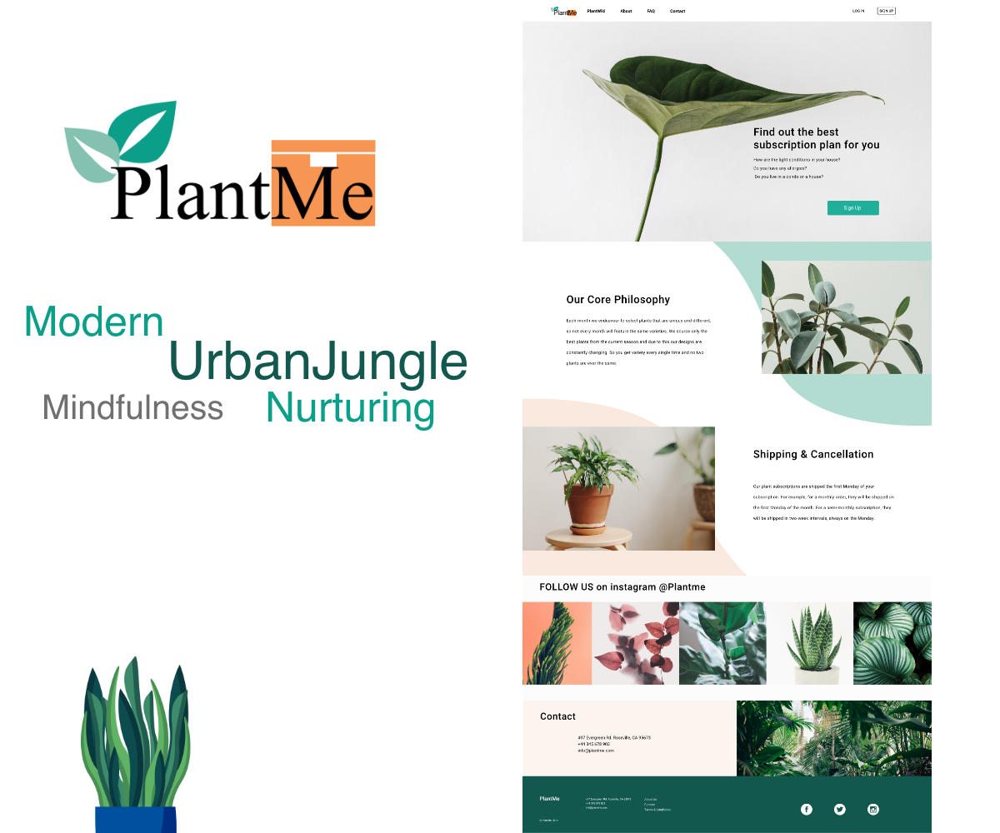

#  Web Design & Development Project - PlantMe
PlantMe is a plant subscription box website for GTA region in Canada. Research shows that millennials really love plants, especially those who live in cities with limited space and time. Subscription plant boxes with good instructions will help them become qualified plant parents and bring wellness to them.

## •	Language and tools: PHP, SQL, JavaScript, HTML, CSS, jQuery

## Landing page video:
https://youtu.be/6JRnlORW_IY
